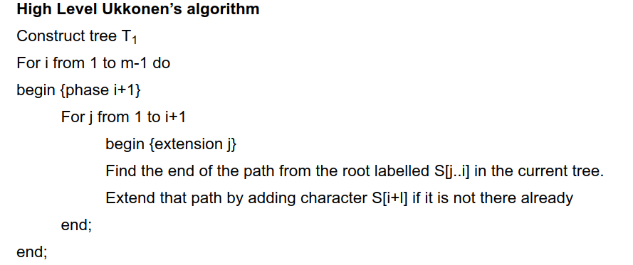
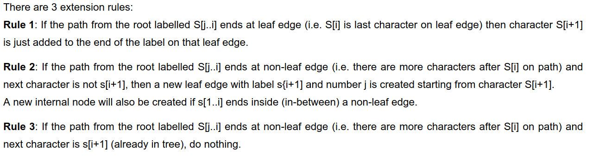

# SUFFIX TREES

## Construction

### Insertion Algorithm : Ukkonen's
Time Complexity &sub; O(n)  
#### Algorithm

 
#### Extention Rules

#### Tricks
<ol style="font-size:1.2em">
    <li>Skip/Count Edge Label Compression</li>
    <li>Rule 3 is a show stopper</li>
    <li>Global end for all the leaf nodes</li>
</ol>

#### Other Terms
<ol style="font-size:1.2em">
    <li>Suffix Links</li>
    <li>Active Points</li>
    <li></li>
</ol>

###  Reference Links
<ul>
    <li>http://brenden.github.io/ukkonen-animation/</li>
    <li>http://www.geeksforgeeks.org/ukkonens-suffix-tree-construction-part-1/</li>
<ul>
